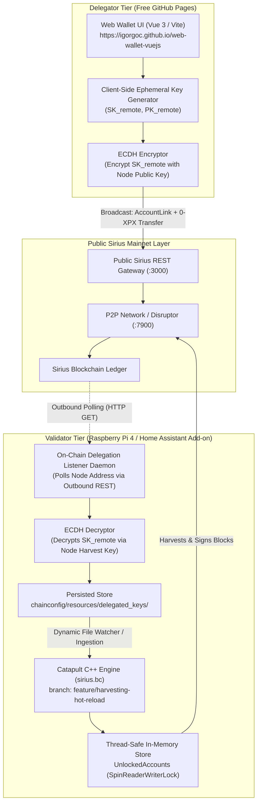

# Implementation Master Plan: Delegated Staking Pool for ProximaX Sirius

---

## 1. Executive Summary & Architectural Vision

### The Goal
Create a frictionless, 1-click, non-custodial delegated staking pool for ProximaX Sirius XPX. The goal is to revitalize the ProximaX ecosystem, lock up circulating XPX supply from exchanges (MEXC, PancakeSwap), increase node decentralization, and provide steady block harvesting rewards to token holders—hosted entirely on a **Raspberry Pi 4 running Home Assistant** and deployed for free on **GitHub Pages**.

### Four Foundational Invariants

1. **Strict Non-Custodial Safety (Token Safety Invariant)**:
   - Delegators' XPX tokens **never leave their personal wallets**.
   - Staking uses Catapult's native `AccountLinkTransaction`. The remote harvesting key has block-signing privileges only; consensus rules permanently forbid remote keys from transferring funds or unlinking themselves ([`RemoteSenderValidator.cpp`](file:///Users/igorgoc/Projects/cpp-xpx-chain/plugins/txes/account_link/src/validators/RemoteSenderValidator.cpp)).
2. **Zero Home Router Inbound Ports (Home NAT & Privacy Invariant)**:
   - The Home Assistant node operates behind residential NAT. **No inbound HTTP/REST ports are opened on the router.**
   - All communication between the Web Wallet and the Raspberry Pi is conducted **100% on-chain** via end-to-end encrypted blockchain messages.
3. **Zero Hosting Costs (Infrastructure Invariant)**:
   - Front-end is hosted on **GitHub Pages** ($0/month, global CDN, automatic HTTPS).
   - Back-end engine runs on the existing **Home Assistant Raspberry Pi 4** (consuming ~5W of power).
4. **Zero Node Downtime (Hot-Reload Invariant)**:
   - New delegators are ingested into the C++ engine's `UnlockedAccounts` memory store dynamically without restarting `sirius.bc`, avoiding P2P churn or missed block hits.

---

## 2. End-to-End System Architecture



---

## 3. Cryptographic & Protocol Flow Specifications

### Step 1: Ephemeral Key Generation in Browser
When the delegator clicks **"Stake to Pool"**:
1. The web wallet calls `Account.generateNewAccount(networkType)`.
2. Produces disposable key pair:
   $$\text{RemoteKeyPair} = (SK_{\text{remote}}, PK_{\text{remote}})$$
3. The delegator's main private key is **never shared**.

### Step 2: On-Chain Encrypted Transmission
1. The web wallet creates an encrypted payload:
   $$\text{Ciphertext} = \text{ECDH\_AES\_GCM}(SK_{\text{remote}}, PK_{\text{node}}, SK_{\text{delegator\_main}})$$
2. The web wallet constructs a single transaction payload:
   * **Transaction 1 (`AccountLinkTransaction`)**: Links delegator's main account to $PK_{\text{remote}}$ (`LinkAction::Link`).
   * **Transaction 2 (`TransferTransaction`)**: Sends `0 XPX` to the Node's public address, with `Message = EncryptedMessage(Ciphertext)`.
3. The user confirms with their wallet password. The transaction is announced to the Sirius REST gateway.

### Step 3: Add-on Listener & Automatic Ingestion
1. The listener daemon inside the Home Assistant add-on polls the node's account transactions:
   `GET https://<sirius-rest>:3000/account/{nodeAddress}/transactions/incoming`
2. When a new transaction with an encrypted message arrives:
   - Verifies the sender has an active on-chain `AccountLink` pointing to the decrypted $PK_{\text{remote}}$.
   - Decrypts the message using the node's local `harvest_key`.
   - Validates that $SK_{\text{remote}}$ corresponds to $PK_{\text{remote}}$.
   - Writes $SK_{\text{remote}}$ to `/data/chainconfig/resources/delegated_keys/<address>.key` (`chmod 0600`).

### Step 4: C++ Catapult Dynamic Hot-Reload
In [`HarvestingService.cpp`](file:///Users/igorgoc/Projects/cpp-xpx-chain/extensions/harvesting/src/HarvestingService.cpp):
1. On each scheduled harvest tick (every 1 second):
   - Check directory `chainconfig/resources/delegated_keys/`.
   - If new keys are found:
     ```cpp
     auto unlockResult = unlockedAccounts.modifier().add(std::move(keyPair));
     ```
   - Because `UnlockedAccounts` is guarded by `utils::SpinReaderWriterLock`, this write operation is thread-safe and completes in $< 1\text{ µs}$.
2. The harvester loop ([`Harvester.cpp#L104`](file:///Users/igorgoc/Projects/cpp-xpx-chain/extensions/harvesting/src/Harvester.cpp#L104)) immediately includes the new key in the candidate block lottery.

---

## 4. Repository & Branching Strategy

| Repository | Base Branch | Target Branch | Role in Architecture |
| :--- | :--- | :--- | :--- |
| **`igorgoc/cpp-xpx-chain`** | `feature/reducedDataSize` (`v1.9.10`) | `feature/harvesting-hot-reload` | C++ Catapult engine: multi-key dynamic directory loader & hot-reload in `HarvestingService.cpp`. |
| **`igorgoc/proximax-sirius-core-native`** | `main` | `feature/staking-pool` | Home Assistant Add-on: background on-chain transaction listener daemon + key storage directory integration. |
| **`igorgoc/web-wallet-vuejs`** | `upstream/master` (forked) | `feature/staking-pool` | Client UI: "Staking Pool" tab, 1-click ephemeral key creation, ECDH encryption, and GitHub Actions CI for GitHub Pages. |

---

## 5. Phase-by-Phase Implementation Roadmap

```
[Phase 1: C++ Engine Hot-Reload]  ──►  [Phase 2: HA Add-on Listener]
                                                │
                                                ▼
[Phase 4: Community Launch & Upstream]  ◄──  [Phase 3: Web Wallet Pool Tab]
```

### Phase 1: C++ Engine Dynamic Multi-Key Loader (`cpp-xpx-chain`)
* **Branch**: `feature/harvesting-hot-reload` off `feature/reducedDataSize`.
* **Tasks**:
  1. **Update `HarvestingConfiguration`**:
     - Raise default `maxUnlockedAccounts` from `5` to `1000`.
     - Add `delegatedKeysDirectory` setting (default: `../resources/delegated_keys`).
  2. **Implement Directory Scanner in `HarvestingService.cpp`**:
     - Inside `CreateHarvestingTask`, add a lightweight directory mtime check before calling `pHarvesterTask->harvest()`.
     - When new `.key` files are detected, read raw private keys, convert to `crypto::KeyPair`, and call `unlockedAccounts.modifier().add(std::move(keyPair))`.
  3. **Preserve Native Pruning**:
     - Ensure existing `PruneUnlockedAccounts()` automatically removes keys if delegators empty their balances.
  4. **CI Compilation**:
     - Trigger GitHub Actions workflow to build multi-arch release binaries (`sirius-linux-arm64.tar.gz` for RPi4, `sirius-linux-amd64.tar.gz`, `sirius-darwin-arm64.tar.gz`).
     - Tag release as `v1.9.14`.

---

### Phase 2: Home Assistant On-Chain Delegation Listener (`proximax-sirius-core-native`)
* **Branch**: `feature/staking-pool`.
* **Tasks**:
  1. **Create Listener Daemon (`addon/delegation-listener.sh` or Go micro-service)**:
     - Runs alongside `catapult.server` in `addon/run.sh`.
     - Polls Sirius REST API for new incoming transactions to the Node Address every 30 seconds.
     - Performs ECDH decryption of `EncryptedMessage` using the container's configured `harvest_key`.
     - Validates on-chain link status before writing to `/data/chainconfig/resources/delegated_keys/`.
  2. **Update Add-On Configuration**:
     - Ensure `/data/chainconfig/resources/delegated_keys` is created with permissions `0700`.
     - Update `addon/config.yaml` version to `1.9.14-1`.

---

### Phase 3: Web Wallet 1-Click Staking Tab (`web-wallet-vuejs`)
* **Repository**: Fork `proximax-foundry/web-wallet-vuejs` to `igorgoc/web-wallet-vuejs`.
* **Tasks**:
  1. **Configure Automated GitHub Pages Build**:
     - Add `.github/workflows/deploy.yml` with `actions/deploy-pages@v4`.
     - Configure `vite.config.ts` base path for GitHub Pages.
  2. **Develop `ViewStakingPool.vue`**:
     - Pool overview dashboard: Node uptime, current pool stake, block hit counter, fee policy (90% to delegator / 10% protocol beneficiary).
     - Delegator account status: Detected XPX balance, current link status (Unlinked / Staked).
  3. **Implement 1-Click Staking Action**:
     - Generate ephemeral `remoteAccount = Account.generateNewAccount(networkType)`.
     - Construct `AccountLinkTransaction` + `TransferTransaction(0 XPX, EncryptedMessage)`.
     - Broadcast transaction and provide instant on-chain transaction hash link to the Sirius explorer.
  4. **Implement 1-Click Unlink Action**:
     - Construct `AccountLinkTransaction` with `LinkAction::Unlink`.
     - Releases the remote key on-chain; node automatically prunes it.

---

### Phase 4: Community Launch, Marketing & Upstream PR
* **Tasks**:
  1. **Live Deployment Verification**:
     - Test complete onboarding flow on Mainnet with a real XPX account.
     - Confirm block generation and 90/10 reward split on explorer.
  2. **Community Announcement**:
     - Publish guide: *"How to Stake XPX in 1-Click on ProximaX Community Node"*.
     - Post in ProximaX Telegram, Discord, and Twitter/X to encourage exchange withdrawals from MEXC and PancakeSwap.
  3. **Upstream Contribution**:
     - Submit PR to `proximax-foundry/web-wallet-vuejs` to include the Staking Pool tab into the official web wallet.

---

## 6. Failure Modes & Security Mitigation Matrix

| Failure Mode / Scenario | Root Cause | Impact | Automated Mitigation |
| :--- | :--- | :--- | :--- |
| **Delegator empties wallet after staking** | Delegator transfers XPX to exchange or another account. | Node wastes CPU cycles calculating hits for a 0-importance key. | Built-in `PruneUnlockedAccounts()` in `HarvestingService.cpp` checks `view.canHarvest()` on every block and automatically evicts disqualified keys from memory. |
| **Spam / Malicious encrypted transactions** | Attacker sends random encrypted garbage to the Node Address. | Potential listener crash or invalid key injection. | Listener verifies: (1) payload decrypts to valid 32-byte hex; (2) sender has an active on-chain `AccountLinkTransaction` matching the public key. Garbage is discarded. |
| **Home Assistant host reboot / power outage** | RPi power interruption. | Node restarts cleanly. | Delegated keys are persisted on disk in `/data/chainconfig/resources/delegated_keys/`. On boot, the C++ engine loads all persisted keys immediately. |
| **Attacker steals hosted remote private keys** | Physical or remote compromise of the Raspberry Pi. | Attacker obtains remote private keys. | **Consensus limits blast radius**: Remote keys cannot spend tokens or unlink accounts ([`RemoteSenderValidator`](file:///Users/igorgoc/Projects/cpp-xpx-chain/plugins/txes/account_link/src/validators/RemoteSenderValidator.cpp)). 90% of all harvested rewards continue to flow directly to delegators' main accounts. |
| **Network fork / tie break** | Two delegators on the same node cross target in the exact same second. | Internal selection collision. | Harvester iterates `UnlockedAccounts` and picks the first valid hit ([`Harvester.cpp#L112`](file:///Users/igorgoc/Projects/cpp-xpx-chain/extensions/harvesting/src/Harvester.cpp#L112)); deterministic and safe. |

---

## 7. Immediate Next Steps Checklist

1. [ ] Create branch `feature/harvesting-hot-reload` in `/Users/igorgoc/Projects/cpp-xpx-chain`.
2. [ ] Implement dynamic directory key loader in `HarvestingService.cpp`.
3. [ ] Test local compilation and verify multi-key ingestion without restart.
4. [ ] Build the delegation listener script for `addon/run.sh`.
5. [ ] Fork and configure `web-wallet-vuejs` for GitHub Pages deployment.
