# Sirius Galaxy: Validator Constellation Visualizer
*A Cosmic Proof-of-Stake Network Visualizer for ProximaX Sirius*

---

## 1. Historical Context: The NEM Star-Map Heritage

In early NEM NIS1 (and the iconic Supernode Rewards program via tools like `nodes.nem.ninja`), the network was visualized as a living cosmic universe rather than boring corporate tables. 

Nodes were represented as **glowing stars** scattered across a deep space void:
- **Luminosity & Size**: Mapped directly to node importance (PoI score), stake, or harvested blocks.
- **Pulsing Novas**: When a node successfully harvested a block, it emitted an expanding pulse of light.
- **Constellation Lines**: Ethereal filaments connected nodes actively gossiping or peering.
- **Side Panel HUD**: A sleek glassmorphic panel detailing ranked nodes, harvested amounts, and network totals.

This visual metaphor is **even more fitting for ProximaX Sirius**: **Sirius** (the "Dog Star") is literally the brightest star in Earth's night sky. Embracing this cosmic identity transforms validator monitoring from dry log inspection into an engaging, pride-of-ownership experience for node operators.

---

## 2. Visual & Architectural Design

```mermaid
flowchart LR
    subgraph GalaxyCanvas ["Cosmic Starfield Canvas (2D/WebGL)"]
        StarField["Deep Space Nebula & Twinkling Background"]
        LocalStar["★ Local Node (Sirius Anchor)<br/>Cyan Glow + Orbit Ring"]
        PeerStars["✦ Active Harvester Stars<br/>Size = Harvested XPX"]
        MeshLines["P2P Network Constellation Filaments"]
        PulseAnim["Real-Time Harvest Shockwave (Nova)"]
    end

    subgraph SidePanelHUD ["Glassmorphic Side Panel HUD"]
        TotalsCard["Network Harvest Totals<br/>XPX Pool & Block Height"]
        NodeList["Ranked Harvesters List<br/>Blocks, XPX Fees, Share %"]
        SelectedCard["Node Inspector Card<br/>Uptime, IP, Last Block"]
    end

    GalaxyCanvas <-->|Hover & Highlight Link| SidePanelHUD
```



---

## 3. Core Visual Components

### A. The Celestial Starfield
* **Background**: Deep void (`#07090E` to `#0B0F19`) with a soft cosmic nebula cloud gradient (deep blue/purple glow) and drifting background stardust particles.
* **The Stars (Validators)**:
  * **Local Node ("You")**: Marked with a double-ring planetary orbit, distinctive **radiant cyan/emerald corona** (`#06B6D4` / `#10B981`), and a pulsing beacon label: `"My Sirius Validator"`.
  * **Star Magnitude (Size)**: Dynamically calculated via logarithmic scaling:
    $$\text{Radius} = R_{\min} + \left(R_{\max} - R_{\min}\right) \cdot \frac{\log(1 + \text{BlocksHarvested})}{\log(1 + \text{MaxBlocks})}$$
    *(Ensures smaller harvesters remain clearly visible while top supernodes look like magnificent stellar giants).*
  * **Star Color Spectrum**:
    - **Top Supernodes (>10% share)**: Blazing Blue-White (`#E0F2FE` / `#38BDF8`).
    - **Active Harvesters (Harvested < 4h)**: Warm Amber-Gold (`#F59E0B` / `#FCD34D`).
    - **Recent Harvesters (< 24h)**: Nebula Purple / Soft Blue (`#818CF8` / `#A78BFA`).
    - **Standby / Syncing Nodes**: Muted Cosmic Silver (`#64748B`).

### B. Live Harvest Shockwaves ("Nova Pulses")
* Whenever Sirius commits a new block height (via `/api/status` or WebSocket):
  1. The winning validator star emits an expanding circular photon ripple.
  2. The particle wave travels along constellation filaments to neighboring peer stars.
  3. A temporary floating badge displays: `+45.2 XPX (Block #14012580)`.

### C. The Glassmorphic Side Panel HUD
Positioned on the right side (width ~340px, collapsible on mobile):
* **Top Metric Bar**:
  - **Total Harvested Pool**: e.g. `2,450,180 XPX`
  - **Active Network Validators**: `18 Online (4h) / 32 Tracked (24h)`
  - **Estimated Staked Pool**: `~145M XPX`
* **Interactive Node Directory**:
  - Search bar (by public key or custom node moniker).
  - Quick filters: `[All] [My Node] [Top 10] [Active 4h]`.
  - Node list items:
    ```text
    #1  54BC...9A12 (Top Harvester)
        Blocks: 412 (28.4%) | Fees: 14,290 XPX
        [Center in Galaxy]
    ```
  - **Hover Synchronization**: Hovering a row in the list causes the corresponding star on the canvas to intensify its halo and draw a targeting reticle.

---

## 4. Performance & Raspberry Pi Optimization

Because many Sirius operators run on **Raspberry Pi 4 (Home Assistant add-on)** or laptops, we cannot use heavy 50MB 3D game engines that consume 100% CPU.

| Rendering Engine | Bundle Overhead | CPU / GPU on Pi 4 | Verdict |
| :--- | :--- | :--- | :--- |
| **Vanilla HTML5 Canvas2D** | **0 KB** (Zero dependencies) | **< 2% CPU** (60 FPS smooth) | **Recommended (Phase 1)** |
| **PixiJS / WebGL 2D** | ~120 KB | < 3% GPU | Great alternative |
| **Three.js (3D Galaxy)** | ~600 KB + 3D shaders | 25-40% GPU (fans spin up) | Overkill for dashboard |

**Recommended Technical Approach**:
- Use a **lightweight, hardware-accelerated Canvas2D engine** embedded in React (`React.useRef<HTMLCanvasElement>`).
- Use particle pooling and render throttles: when the user isn't interacting and no new blocks are arriving, drop to 15 FPS idle to save energy; spin up to 60 FPS during zoom/pan/harvest shockwaves.

---

## 5. Proposed Placement in the App

In the current navigation bar ([NavigationTabs.tsx](file:///Users/igorgoc/Projects/proximax-sirius-core-native/frontend/src/components/NavigationTabs.tsx)), we have:
`[Overview]` `[Validator]` `[Network]` `[Settings]` `[Maintenance]`

Two natural ways to integrate this:
1. **Inside Validator Tab**: Add a sub-view toggle:
   ```text
   [ Harvest Overview ]   [ Constellation Galaxy ]   [ Local Storage ]
   ```
2. **Dedicated Star Icon in Header**: A cosmic button (e.g. `✦ Sirius Constellation`) next to the node status indicator that opens the full-screen interactive universe view.

---

## 6. Next Steps & Implementation Roadmap

1. **Phase 1 (Data Model)**: Connect existing `networkValidatorStats.topValidators` and `peersDetail` to the star coordinates generator (using reproducible hash-based spatial distribution so star positions remain stable across reloads).
2. **Phase 2 (Canvas Engine)**: Implement `SiriusGalaxyCanvas.tsx` with smooth zoom, pan, star glow shaders, and local node highlight.
3. **Phase 3 (HUD & Interactivity)**: Integrate the glassmorphism side panel, click-to-focus camera interpolation, and live harvest shockwaves.
